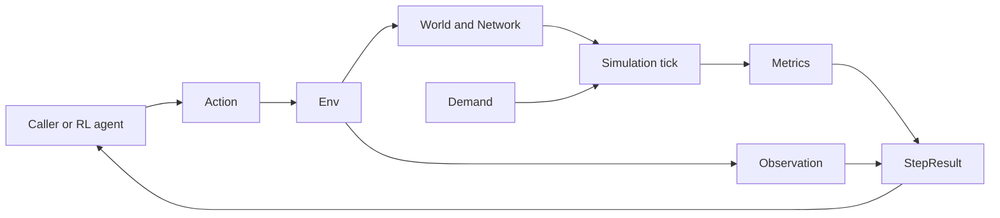
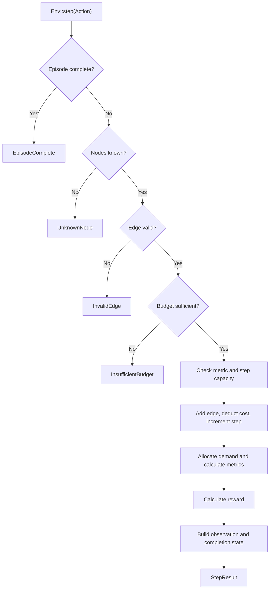

# Architecture

`urbanflow` is currently distributed as a Rust library. It provides the state and transition core for a reinforcement learning environment that builds and evaluates multimodal urban transit networks. Applications, websites, and other interfaces are planned consumers of this library; they are not implemented here yet.

## Overview

The public API is organized around `Env`. A caller submits an `Action`, the environment validates and applies it to a `World`, the private simulation module allocates demand over the resulting `Network`, and the environment returns an `Observation`, `Metrics`, reward, and completion flag in a `StepResult`.

The library core owns domain behavior. Future interface layers should call the library rather than reimplementing topology, allocation, metrics, or reward logic.

## Environment Step Flow

Expected errors return before mutation. Overflow checks also run before mutation so a failed step does not leave partial state behind.

## Core Model

- `Action` describes an agent request. The only current action adds a typed directed edge.
- `Env` owns the current `World`, demands, metrics, budget, step counter, and episode limit. It validates actions, commits successful transitions, calculates reward, and creates agent-facing snapshots.
- `World` owns the fixed toy-city nodes and a `Network`. `Network` stores typed directed edges in insertion order.
- `EdgeKind` currently supports Road and Rail and owns each mode's capacity and construction cost.
- `Demand` describes an origin, destination, and requested amount.
- `ConnectivityIndex` derives an adjacency list from a `Network` and finds directed shortest paths with breadth-first search.
- `simulation::tick` allocates capacity to demands and returns aggregate `Metrics`. It is crate-private so callers cannot bypass the environment API accidentally.
- `Observation` is an owned snapshot of agent-visible state. `StepResult` combines that snapshot with reward, completion state, and metrics.

## Module Map

| Module        | Visibility    | Responsibility                                                  |
| ------------- | ------------- | --------------------------------------------------------------- |
| `action`      | Public        | Agent action types                                              |
| `demand`      | Public        | Passenger demand model                                          |
| `env`         | Public        | Episode lifecycle, validation, mutation, reward, and results    |
| `metrics`     | Public        | Aggregate simulation output                                     |
| `network`     | Public        | Derived reachability and path queries                           |
| `observation` | Public        | Agent-facing state snapshots                                    |
| `simulation`  | Crate-private | Demand allocation and metric calculation                        |
| `step_result` | Public        | Successful step output                                          |
| `world`       | Public        | Nodes, edges, modes, network storage, and toy-city construction |

## Simulation Contracts

- Edges are directed. A two-way connection requires two edges and pays both construction costs.
- Self-connections and duplicate edges of the same mode are rejected. Road and Rail edges may connect the same ordered node pair.
- Each reachable demand follows the first shortest path by hop count. Equal-hop paths follow edge insertion order.
- Demands consume shared capacity in stored order. Reordering demands can change which destination receives constrained capacity.
- Served demand is limited by the smallest remaining capacity along its path. Unreachable and excess demand is unserved.
- Congestion is the maximum edge load divided by capacity, or zero for a network without edges. Cost is the sum of edge construction costs.
- Reward is `served demand - unserved demand - congestion - cost`.
- Invalid steps do not change the world, budget, step counter, metrics, or observations.

These contracts are observable behavior. Change them deliberately and update focused unit tests, integration tests, README examples, and this document together.

## Behavior Boundaries

- Put transit data types, edge validation, capacities, and construction costs in `world`.
- Put graph indexing, reachability, and path selection in `network`.
- Put capacity allocation and aggregate metric calculation in `simulation`.
- Put episode completion, action orchestration, reward calculation, and snapshot creation in `env`.
- Keep public data-transfer types small and owned so callers can retain observations and results without borrowing environment internals.
- Build future bindings and services on the public crate API. Do not fork simulation rules into an interface layer.

## Planned Direction

The project intends to expand in four directions:

- Add transit modes such as trams and demand-responsive transit (DRT).
- Support both macro-level network analysis and micro-level movement and service analysis.
- Expose reusable interfaces for applications, websites, and other platforms.
- Perform large-scale simulations with low latency.

These are goals, not implemented architecture. Introduce new modules and boundaries only when a focused issue defines their behavior, data requirements, and validation criteria. Preserve one simulation source of truth as new consumers are added.

## Developing

Keep changes at the lowest shared layer that owns the rule. A new mode usually starts in `world`; a shared path-selection change belongs in `network`; allocation policy belongs in `simulation`; episode behavior belongs in `env`.

Use the narrowest validation that covers the change:

| Change type                              | Validation                                                                             |
| ---------------------------------------- | -------------------------------------------------------------------------------------- |
| Documentation only                       | Review Markdown and run `typos` when available                                         |
| Domain type or validation                | Focused unit tests, then the full Rust checks                                          |
| Routing or allocation                    | `network` or `simulation` tests, affected integration tests, then the full Rust checks |
| Environment lifecycle or public behavior | `env` and affected integration tests, then the full Rust checks                        |
| Build, dependency, or CI                 | Re-run every affected command from CI                                                  |
