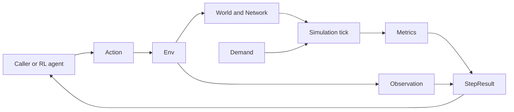
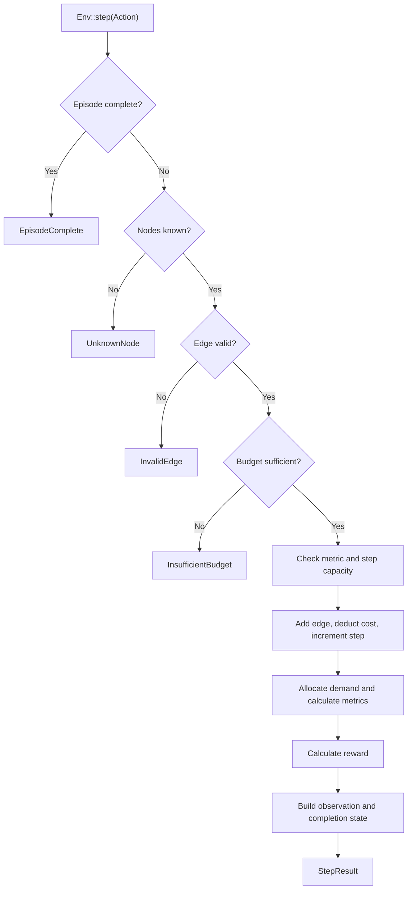

# Architecture

`urbanflow` is currently distributed as a Rust library. It provides the state and transition core for a reinforcement learning environment that builds and evaluates multimodal urban transit networks. Applications, websites, and other interfaces are planned consumers of this library; they are not implemented here yet.

## Overview

The public API is organized around `Env`. A caller submits an `Action`, the environment validates and applies it to a `World`, the private simulation module allocates demand over the resulting `Network`, and the environment returns an `Observation`, `Metrics`, reward, and completion flag in a `StepResult`.

The public `time` module provides a deterministic simulation clock. `RailVehicle::advance` advances the caller's clock together with one vehicle's movement and stop processing, independently of `Env`.

The public `rail` module validates an ordered fixed route and the capacity and timing configuration for one Rail vehicle before constructing them. It tracks ordered passenger lifecycle records and advances the vehicle through dwell, travel, and completion states one tick at a time. Stop processing runs automatically on the first tick and on each arrival, alighting passengers before boarding eligible waiting demand within vehicle capacity. Final arrival completes service and marks outstanding demand unserved. Callers can retain owned movement snapshots from the same vehicle, clock, and passenger records at any tick, or record a bounded trace through completion or a caller-supplied tick limit.

The library core owns domain behavior. Future interface layers should call the library rather than reimplementing topology, allocation, metrics, or reward logic.

## Environment Step Flow

Expected errors return before mutation. Overflow checks also run before mutation so a failed step does not leave partial state behind.

## Scenario Lifecycle

`Env::new(world, demands, budget, max_steps)` is the supported entry point for caller-defined scenarios. Before constructing any environment state, it validates topology, then demand endpoints, then the budget. Validation rejects duplicate node identifiers, initial edges with unknown endpoints, demands with unknown endpoints, and negative or non-finite budgets. The first error in that deterministic order is returned as `InitError`.

Successful construction preserves the caller's node, edge, and demand order and stores the initial world, demands, and budget for later episodes. `reset()` restores those stored values, clears metrics, resets the step counter to zero, and returns an owned observation of the restored state. It leaves `max_steps` unchanged, so the environment keeps its current episode limit across resets. Replaying the same actions after a reset therefore produces the same results.

`Env::toy_city(max_steps)` is a convenience constructor for the built-in scenario. It delegates to `Env::new`, so configurable and built-in scenarios share the same validation and reset path.

## Training Consumers

The `random_policy` and `tabular_q_learning` examples are consumers of the public library API, not part of the environment core. Their shared baseline constructs a scenario with `Env::new`, starts each episode with `reset`, obtains valid actions from `available_actions`, and applies the selected action with `step`. Policy state and action selection remain outside the library.

The baseline is deliberately limited to one decision state and one step per episode. It uses a fixed seed for reproducibility, and the learner keeps one tabular value per available action. It has no state table, discounting, function approximation, deep RL integration, Python interface, visualization tooling, or general multi-step training loop. Those capabilities remain future consumers or separately scoped work rather than implemented architecture.

## Core Model

- `Action` describes an agent request. The only current action adds a typed directed edge.
- `Env` owns the current `World`, demands, metrics, budget, step counter, and episode limit. It also retains the caller-defined initial world, demands, and budget so `reset` can start deterministic repeat episodes. It exposes valid affordable actions in deterministic order, validates submitted actions, commits successful transitions, calculates reward, and creates agent-facing snapshots.
- `Env::new` validates caller-defined inputs and establishes complete initial state. `InitError` reports invalid topology, demand endpoints, and budgets separately from `StepError`.
- `Env::toy_city` supplies the supported four-node world, demand, and budget to `Env::new`, keeping convenience construction on the same initialization and reset path.
- `World` owns caller-defined nodes in their supplied order and a `Network`. `Network` stores typed directed edges in insertion order.
- `EdgeKind` currently supports Road and Rail and owns each mode's capacity and construction cost.
- `Demand` describes an origin, destination, and requested amount.
- `ConnectivityIndex` derives an adjacency list from a `Network` and finds directed shortest paths with breadth-first search.
- `simulation::tick` allocates capacity to demands and returns aggregate `Metrics`. It is crate-private so callers cannot bypass the environment API accidentally.
- `SimulationClock` starts at tick zero and advances by one checked integer tick through an explicit operation.
- `RailRoute` validates and stores Rail edge identifiers in caller-supplied order, along with their stop node sequence captured from the validated network. Stop processing uses this owned sequence without requiring another network reference. `RailVehicle` owns a validated route, validates one vehicle's capacity and fixed edge-travel and stop-dwell durations, then starts it at the first stop. Read-only accessors expose the route, configuration, and current state.
- `RailVehicle::advance` coordinates one checked clock tick, vehicle movement, and automatic passenger stop processing. It returns the resulting `RailVehicleState` or a typed `RailStepError`, preserving all inputs on failure. Completion is a no-op on later calls.
- `RailVehicle::snapshot` returns an owned `RailSnapshot` with the supplied clock tick, a resolved `RailPosition`, occupancy, capacity, and ordered `PassengerState` copies. Positions contain route indices and actual node or edge identifiers; traveling positions include endpoint nodes and integer elapsed and total ticks, and completed positions retain the final stop. Snapshot creation reads the existing simulation state without advancing it or copying the entire route.
- `RailVehicle::record_trace` reuses `advance` and `snapshot` to return a `RailTrace` containing the initial state and each subsequent tick in order. A required tick limit bounds advancement; the trace's `completed` flag distinguishes completed service from a partial run. The trace owns every frame for consumers to replay without implementing movement rules.
- `RailPassengers` owns one `PassengerState` per original demand in stored order. It exposes read-only counts and applies validated waiting-to-onboard and onboard-to-arrived transfers by demand index. `process_stop` applies those transfers atomically for a caller-selected route stop, alighting before boarding eligible demand within the supplied vehicle's capacity. Service completion preserves arrivals and marks all outstanding passengers unserved.
- `Observation` is an owned snapshot of agent-visible state, including a variable-size node list in world order. `StepResult` combines that snapshot with reward, completion state, and metrics.

## Module Map

| Module        | Visibility    | Responsibility                                                          |
| ------------- | ------------- | ----------------------------------------------------------------------- |
| `action`      | Public        | Agent action types                                                      |
| `demand`      | Public        | Passenger demand model                                                  |
| `env`         | Public        | Episode lifecycle, validation, mutation, reward, and results            |
| `metrics`     | Public        | Aggregate simulation output                                             |
| `network`     | Public        | Derived reachability and path queries                                   |
| `observation` | Public        | Agent-facing state snapshots                                            |
| `rail`        | Public        | Rail routes, vehicle ticks, passenger lifecycle, snapshots, and traces |
| `simulation`  | Crate-private | Demand allocation and metric calculation                                |
| `step_result` | Public        | Successful step output                                                  |
| `time`        | Public        | Deterministic checked simulation time                                   |
| `world`       | Public        | Nodes, edges, modes, network storage, and toy-city construction         |

## Simulation Contracts

- Edges are directed. A two-way connection requires two edges and pays both construction costs.
- Self-connections and duplicate edges of the same mode are rejected. Road and Rail edges may connect the same ordered node pair.
- Each reachable demand follows the first shortest path by hop count. Equal-hop paths follow edge insertion order.
- Demands consume shared capacity in stored order. Reordering demands can change which destination receives constrained capacity.
- Served demand is limited by the smallest remaining capacity along its path. Unreachable and excess demand is unserved.
- Congestion is the maximum edge load divided by capacity, or zero for a network without edges. Cost is the sum of edge construction costs.
- Reward is `served demand - unserved demand - congestion - cost`.
- Simulation time starts at tick zero. Each successful clock advance adds exactly one tick; overflow returns an error without changing the clock.
- Rail routes are non-empty, contain connected Rail edges that exist in the selected network, and preserve stored edge order. Vehicle capacity and travel and dwell durations are positive. A new vehicle starts at the first stop with its configured dwell time remaining.
- Vehicle state identifies positions relative to its owned route and stores dwell ticks remaining or travel ticks elapsed. `edge_index` selects a route edge; stop zero is the first edge's origin, and stop `i > 0` is route edge `i - 1`'s destination. The final stop index equals the route's edge count.
- Movement snapshots own all returned data, preserving demand order, duplicate demands, and zero-amount records across later ticks. `RailPosition` resolves network identifiers from the validated route while retaining route indices to distinguish repeated visits. Traveling progress is an integer elapsed/total pair with elapsed strictly below total; arrival is represented by the next stop or final completion position. Snapshot reads do not advance time, process stops, or mutate any service input.
- Snapshot occupancy and stop processing share a checked sum of all onboard records. A total exceeding `u32::MAX` returns `RailPassengerError::CountOverflow`. Snapshots report explicit accounting occupancy above capacity without clamping or applying stop validation. Callers supply the same clock and passenger records used for that vehicle's service. Coordinates, animation timing, and serialization remain consumer responsibilities.
- Trace recording captures the supplied current state before advancing, then one owned snapshot per successful tick. `max_ticks` counts advances in this call, not an absolute clock deadline or the initial frame. Zero limits and already completed services return one frame. Completion on the last allowed tick reports `completed == true`; hitting the limit earlier returns a partial trace without forcing passenger completion. Recording can continue from that state, with its next initial frame repeating the prior final frame. Identical service inputs and limits yield equal traces.
- Trace recording allocates frames incrementally, retaining at most the initial frame plus `max_ticks` frames. Each frame copies all passenger records, so callers choose a suitable in-memory bound. Snapshot failures map to `RailStepError::Passengers`; movement failures retain their existing typed errors. Errors return no trace. Initial snapshot failure leaves all inputs unchanged; later errors retain prior successful tick progress, with the failed tick remaining atomic. Recording does not introduce storage formats, streaming, persistence, or transport.
- Each active `RailVehicle::advance` consumes exactly one tick. The initial stop is processed before the first dwell tick is consumed. Consuming the last dwell tick starts travel at zero elapsed ticks; later calls advance integer progress until the configured travel duration is reached. Arrival processes the next stop on that same tick and starts its full dwell, without consuming a dwell tick on arrival.
- Final arrival processes alighting, marks all remaining waiting or onboard passengers unserved, and enters `Complete` immediately, without a final dwell. Further advances return `Complete` without changing time or passenger records.
- Vehicle advancement checks a copy of the clock before any stop processing, then commits the clock and vehicle state only after passenger processing succeeds. `RailStepError::Time` and `RailStepError::Passengers` distinguish failures; time overflow takes precedence. Stop processing is already atomic, and completion cannot fail, so errors preserve the vehicle, clock, and all passenger records together.
- Rail passenger records preserve every demand, including duplicates and zero amounts. All passengers start waiting, and waiting, onboard, arrived, and unserved counts always sum to the original demand amount. Transfers reject unknown demand indices or insufficient source counts before mutation. After final-stop arrivals are recorded, explicit completion moves all remaining passengers to unserved and is idempotent.
- Rail stop processing alights all onboard destination passengers first, then boards waiting demand in stored order up to the remaining vehicle capacity. Boarding requires the current stop as origin and a destination strictly later in the route. Repeated nodes use the remaining stop sequence, so same-origin/destination demand boards only if that node appears again later. Excess and ineligible demand stays waiting; the final stop only alights.
- Stop processing validates the stop index, checked aggregate occupancy, and initial capacity before transfers. It applies checked count transfers to a copy and commits only after the entire stop succeeds. Unknown stops, excess initial occupancy, and count overflow leave all passenger records unchanged. Every onboard record counts toward capacity, including explicit accounting transfers.
- The caller keeps the same clock and passenger records for one service and invokes `advance`, which processes each stop once per visit and completes at the final stop. Manual callers of `process_stop(&vehicle, stop_index)` must follow route order starting at zero and call `complete` after the final stop; they must not duplicate the automatic calls. The standalone stop operation does not check or advance vehicle state or consume ticks.
- Available actions enumerate stored nodes in `from`/`to` order and `EdgeKind::ALL` order, excluding invalid or unaffordable edges. The list is empty after the step limit.
- Invalid steps do not change the world, budget, step counter, metrics, or observations.

These contracts are observable behavior. Change them deliberately and update focused unit tests, integration tests, README examples, and this document together.

## Behavior Boundaries

- Put transit data types, edge validation, capacities, and construction costs in `world`.
- Put graph indexing, reachability, and path selection in `network`.
- Put capacity allocation and aggregate metric calculation in `simulation`.
- Keep Rail passenger lifecycle accounting, stop processing, vehicle tick transitions, movement snapshot construction, and bounded trace recording in `rail`. Explicit count transfers remain accounting primitives; `process_stop` enforces route eligibility and vehicle capacity, and `RailVehicle::advance` sequences stops and clock ticks. Snapshots and traces expose that state through owned public data without rendering logic or serialization dependencies. The existing `Env` demand allocation and metrics do not consume lifecycle records, movement snapshots, or traces. Multiple vehicles, reverse service, and traffic interactions remain separate work.
- Put episode completion, action orchestration, reward calculation, and snapshot creation in `env`.
- Keep public data-transfer types small and owned so callers can retain observations and results without borrowing environment internals.
- Build future bindings and services on the public crate API. Do not fork simulation rules into an interface layer.

## Planned Direction

The project intends to expand in four directions:

- Add transit modes such as trams and demand-responsive transit (DRT).
- Support both macro-level network analysis and micro-level movement and service analysis.
- Expose reusable interfaces for applications, websites, and other platforms.
- Perform large-scale simulations with low latency.

These are goals, not implemented architecture. Introduce new modules and boundaries only when a focused issue defines their behavior, data requirements, and validation criteria. Preserve one simulation source of truth as new consumers are added.

## Developing

Keep changes at the lowest shared layer that owns the rule. A new mode usually starts in `world`; a shared path-selection change belongs in `network`; allocation policy belongs in `simulation`; episode behavior belongs in `env`.

Use the narrowest validation that covers the change:

| Change type                              | Validation                                                                             |
| ---------------------------------------- | -------------------------------------------------------------------------------------- |
| Documentation only                       | Review Markdown and run `typos` when available                                         |
| Domain type or validation                | Focused unit tests, then the full Rust checks                                          |
| Routing or allocation                    | `network` or `simulation` tests, affected integration tests, then the full Rust checks |
| Environment lifecycle or public behavior | `env` and affected integration tests, then the full Rust checks                        |
| Build, dependency, or CI                 | Re-run every affected command from CI                                                  |
