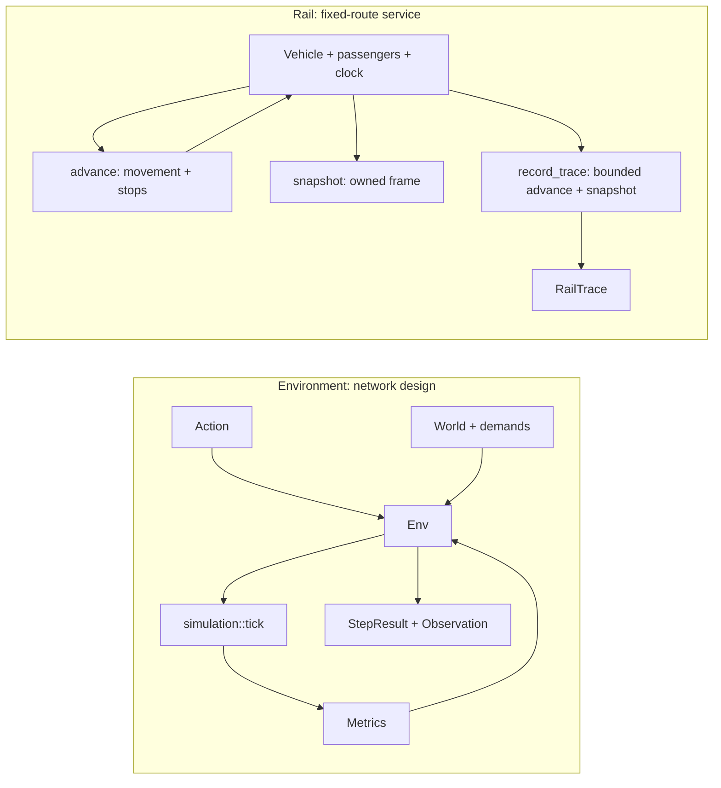

# Architecture

`urbanflow` is a Rust library with two independent simulation paths: `Env` evaluates network-building actions through aggregate demand allocation, while `rail` models one vehicle's timed service. Rail movement does not advance with `Env::step` or feed its metrics.

See [README](README.md) for usage and [AGENTS](AGENTS.md) for contributor rules and validation commands. Detailed API contracts live beside the source linked below.

## Overview

The library owns simulation rules. Owned observations, snapshots, and traces let consumers retain results and replay movement without borrowing live state or reimplementing those rules.

## Module Map

| Modules | Visibility | Responsibility |
| --- | --- | --- |
| [`world`](src/world.rs), [`demand`](src/demand.rs) | Public | Nodes, directed edges, mode capacities and costs, and passenger demand |
| [`network`](src/network.rs) | Public | Derived adjacency index and directed shortest-path queries |
| [`simulation`](src/simulation.rs) | Crate-private | Capacity allocation and aggregate metrics, invoked through `Env` |
| [`env`](src/env.rs), [`action`](src/action.rs) | Public | Scenario lifecycle, action validation, episode state, and rewards |
| [`time`](src/time.rs) | Public | Checked integer simulation clock |
| [`rail`](src/rail.rs) | Public | Validated routes, vehicle ticks, passenger lifecycle, snapshots, and traces |
| [`metrics`](src/metrics.rs), [`observation`](src/observation.rs), [`step_result`](src/step_result.rs) | Public | Owned outputs for callers |

## Execution Flows

### Environment

`Env::new` validates topology (duplicate node IDs, then initial-edge endpoints), demand endpoints in stored order, and finally a finite nonnegative budget, returning the first `InitError`. It preserves supplied node, edge, and demand order. `Env::toy_city` supplies a built-in scenario through this same constructor.

`Env::step` checks episode completion, node endpoints, edge validity, affordability, and arithmetic overflow before mutating anything. It then adds the edge, deducts its cost, increments the step count, allocates demand, and returns metrics, reward, an owned observation, and completion status. Rejected steps leave all environment state unchanged.

`reset()` restores the initial world, demands, and budget, clears metrics and the step count, and returns an observation. It keeps the current `max_steps`, allowing the same actions to reproduce an episode.

### Rail Service

A `RailRoute` validates a nonempty, ordered sequence of connected Rail edges and owns their IDs and stop nodes captured from the network. A `RailVehicle` owns that route and positive capacity, travel, and dwell durations. Route indices can differ from network IDs: stop zero is the first origin, stop `i > 0` is edge `i - 1`'s destination, and the final stop index is the edge count.

The caller keeps one vehicle, clock, and passenger set together. `advance` coordinates one checked tick, movement, and stop processing atomically. Stops alight before boarding eligible demand in stored order within capacity; repeated nodes use the remaining stop sequence. Final arrival completes service and marks outstanding passengers unserved; further advances are no-ops.

`snapshot` reads an owned frame. `record_trace` reuses `advance` and `snapshot` to record the initial state and each tick until completion or a required tick limit, reporting incomplete runs through `completed`. A trace error returns no trace but retains earlier successful ticks. Tick sequencing, count validation, and snapshot/trace edge cases are specified in the [Rail API](src/rail.rs).

## Simulation Contracts

- Edges are directed; a return connection requires another edge and its construction cost. Self-connections and same-mode duplicates are rejected, while Road and Rail may share an ordered node pair.
- Each demand follows the first shortest path by hop count, breaking ties by edge insertion order. Demands consume shared capacity in stored order, limited by the smallest remaining capacity on their path; unreachable and excess demand is unserved.
- Congestion is the maximum edge load divided by capacity, or zero without edges. Cost sums all edge construction costs. Reward is `served demand - unserved demand - congestion - cost`.
- Available actions follow stored `from` node order, `to` node order, then `EdgeKind::ALL`, omitting invalid or unaffordable edges. The list is empty at the step limit; an episode is done whenever no actions remain.
- Simulation time starts at zero and uses checked integer ticks. Time and passenger processing errors preserve the failed Rail tick's vehicle, clock, and passengers together.
- Rail passenger counts preserve each original demand, including duplicates and zero amounts: waiting, onboard, arrived, and unserved always sum to its amount. Owned outputs retain their data across later state changes.

## Training Consumers

The [`random_policy`](examples/random_policy.rs) and [`tabular_q_learning`](examples/tabular_q_learning.rs) examples use `reset`, `available_actions`, and `step` through the public API. Policy state stays outside the core. These are fixed-seed baselines with one decision and one step per episode; the learner keeps one value per action, without a general state table or multi-step training loop.

## Planned Direction

Trams, DRT, broader macro- and micro-level analysis, application interfaces, and large-scale low-latency simulation remain planned. The Rail service currently has one fixed-route vehicle; multiple vehicles, reverse service, and traffic interactions are separate work.

Future interfaces should use the public crate API and keep rendering, coordinates, serialization, storage, and transport in consumer layers. Add new modules only when a concrete requirement establishes their responsibility.
