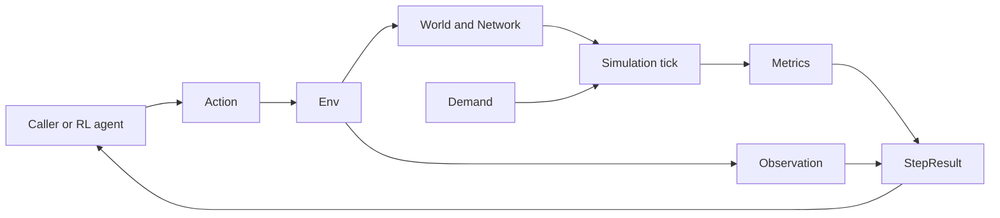
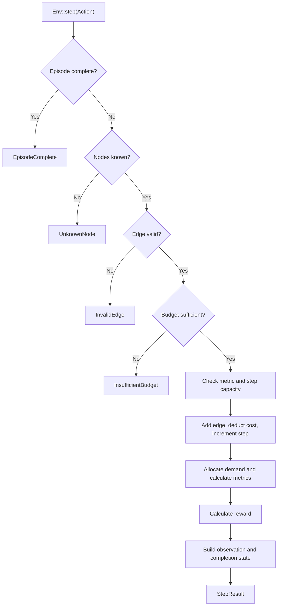

# Architecture

`urbanflow` is currently distributed as a Rust library. It provides the state and transition core for a reinforcement learning environment that builds and evaluates multimodal urban transit networks. Applications, websites, and other interfaces are planned consumers of this library; they are not implemented here yet.

## Overview

The public API is organized around `Env`. A caller submits an `Action`, the environment validates and applies it to a `World`, the private simulation module allocates demand over the resulting `Network`, and the environment returns an `Observation`, `Metrics`, reward, and completion flag in a `StepResult`.

The public `time` module provides an independent deterministic simulation clock. Vehicle movement does not consume or expose that clock yet.

The public `rail` module provides an ordered fixed route and the capacity, timing, and position state for one Rail vehicle. These are data types only; route validation and tick transitions are not implemented yet.

The library core owns domain behavior. Future interface layers should call the library rather than reimplementing topology, allocation, metrics, or reward logic.

## Environment Step Flow

Expected errors return before mutation. Overflow checks also run before mutation so a failed step does not leave partial state behind.

## Scenario Lifecycle

`Env::new(world, demands, budget, max_steps)` is the supported entry point for caller-defined scenarios. Before constructing any environment state, it validates topology, then demand endpoints, then the budget. Validation rejects duplicate node identifiers, initial edges with unknown endpoints, demands with unknown endpoints, and negative or non-finite budgets. The first error in that deterministic order is returned as `InitError`.

Successful construction preserves the caller's node, edge, and demand order and stores the initial world, demands, and budget for later episodes. `reset()` restores those stored values, clears metrics, resets the step counter to zero, and returns an owned observation of the restored state. It leaves `max_steps` unchanged, so the environment keeps its current episode limit across resets. Replaying the same actions after a reset therefore produces the same results.

`Env::toy_city(max_steps)` is a convenience constructor for the built-in scenario. It delegates to `Env::new`, so configurable and built-in scenarios share the same validation and reset path.

## Training Consumers

The `random_policy` and `tabular_q_learning` examples are consumers of the public library API, not part of the environment core. Their shared baseline constructs a scenario with `Env::new`, starts each episode with `reset`, obtains valid actions from `available_actions`, and applies the selected action with `step`. Policy state and action selection remain outside the library.

The baseline is deliberately limited to one decision state and one step per episode. It uses a fixed seed for reproducibility, and the learner keeps one tabular value per available action. It has no state table, discounting, function approximation, deep RL integration, Python interface, visualization tooling, or general multi-step training loop. Those capabilities remain future consumers or separately scoped work rather than implemented architecture.

## Core Model

- `Action` describes an agent request. The only current action adds a typed directed edge.
- `Env` owns the current `World`, demands, metrics, budget, step counter, and episode limit. It also retains the caller-defined initial world, demands, and budget so `reset` can start deterministic repeat episodes. It exposes valid affordable actions in deterministic order, validates submitted actions, commits successful transitions, calculates reward, and creates agent-facing snapshots.
- `Env::new` validates caller-defined inputs and establishes complete initial state. `InitError` reports invalid topology, demand endpoints, and budgets separately from `StepError`.
- `Env::toy_city` supplies the supported four-node world, demand, and budget to `Env::new`, keeping convenience construction on the same initialization and reset path.
- `World` owns caller-defined nodes in their supplied order and a `Network`. `Network` stores typed directed edges in insertion order.
- `EdgeKind` currently supports Road and Rail and owns each mode's capacity and construction cost.
- `Demand` describes an origin, destination, and requested amount.
- `ConnectivityIndex` derives an adjacency list from a `Network` and finds directed shortest paths with breadth-first search.
- `simulation::tick` allocates capacity to demands and returns aggregate `Metrics`. It is crate-private so callers cannot bypass the environment API accidentally.
- `SimulationClock` starts at tick zero and advances by one checked integer tick through an explicit operation.
- `RailRoute` stores Rail edge identifiers in caller-supplied order. `RailVehicle` stores one vehicle's capacity, fixed edge-travel and stop-dwell durations, and current stop, edge, or completion state.
- `Observation` is an owned snapshot of agent-visible state, including a variable-size node list in world order. `StepResult` combines that snapshot with reward, completion state, and metrics.

## Module Map

| Module        | Visibility    | Responsibility                                                  |
| ------------- | ------------- | --------------------------------------------------------------- |
| `action`      | Public        | Agent action types                                              |
| `demand`      | Public        | Passenger demand model                                          |
| `env`         | Public        | Episode lifecycle, validation, mutation, reward, and results    |
| `metrics`     | Public        | Aggregate simulation output                                     |
| `network`     | Public        | Derived reachability and path queries                           |
| `observation` | Public        | Agent-facing state snapshots                                    |
| `rail`        | Public        | Fixed Rail routes and one vehicle's tick-based state            |
| `simulation`  | Crate-private | Demand allocation and metric calculation                        |
| `step_result` | Public        | Successful step output                                          |
| `time`        | Public        | Deterministic checked simulation time                           |
| `world`       | Public        | Nodes, edges, modes, network storage, and toy-city construction |

## Simulation Contracts

- Edges are directed. A two-way connection requires two edges and pays both construction costs.
- Self-connections and duplicate edges of the same mode are rejected. Road and Rail edges may connect the same ordered node pair.
- Each reachable demand follows the first shortest path by hop count. Equal-hop paths follow edge insertion order.
- Demands consume shared capacity in stored order. Reordering demands can change which destination receives constrained capacity.
- Served demand is limited by the smallest remaining capacity along its path. Unreachable and excess demand is unserved.
- Congestion is the maximum edge load divided by capacity, or zero for a network without edges. Cost is the sum of edge construction costs.
- Reward is `served demand - unserved demand - congestion - cost`.
- Simulation time starts at tick zero. Each successful advance adds exactly one tick; overflow returns an error without changing the clock.
- Rail routes preserve stored edge order. Vehicle state identifies positions by stop or edge index and stores dwell ticks remaining or travel ticks elapsed.
- Available actions enumerate stored nodes in `from`/`to` order and `EdgeKind::ALL` order, excluding invalid or unaffordable edges. The list is empty after the step limit.
- Invalid steps do not change the world, budget, step counter, metrics, or observations.

These contracts are observable behavior. Change them deliberately and update focused unit tests, integration tests, README examples, and this document together.

## Behavior Boundaries

- Put transit data types, edge validation, capacities, and construction costs in `world`.
- Put graph indexing, reachability, and path selection in `network`.
- Put capacity allocation and aggregate metric calculation in `simulation`.
- Put episode completion, action orchestration, reward calculation, and snapshot creation in `env`.
- Keep public data-transfer types small and owned so callers can retain observations and results without borrowing environment internals.
- Build future bindings and services on the public crate API. Do not fork simulation rules into an interface layer.

## Planned Direction

The project intends to expand in four directions:

- Add transit modes such as trams and demand-responsive transit (DRT).
- Support both macro-level network analysis and micro-level movement and service analysis.
- Expose reusable interfaces for applications, websites, and other platforms.
- Perform large-scale simulations with low latency.

These are goals, not implemented architecture. Introduce new modules and boundaries only when a focused issue defines their behavior, data requirements, and validation criteria. Preserve one simulation source of truth as new consumers are added.

## Developing

Keep changes at the lowest shared layer that owns the rule. A new mode usually starts in `world`; a shared path-selection change belongs in `network`; allocation policy belongs in `simulation`; episode behavior belongs in `env`.

Use the narrowest validation that covers the change:

| Change type                              | Validation                                                                             |
| ---------------------------------------- | -------------------------------------------------------------------------------------- |
| Documentation only                       | Review Markdown and run `typos` when available                                         |
| Domain type or validation                | Focused unit tests, then the full Rust checks                                          |
| Routing or allocation                    | `network` or `simulation` tests, affected integration tests, then the full Rust checks |
| Environment lifecycle or public behavior | `env` and affected integration tests, then the full Rust checks                        |
| Build, dependency, or CI                 | Re-run every affected command from CI                                                  |
