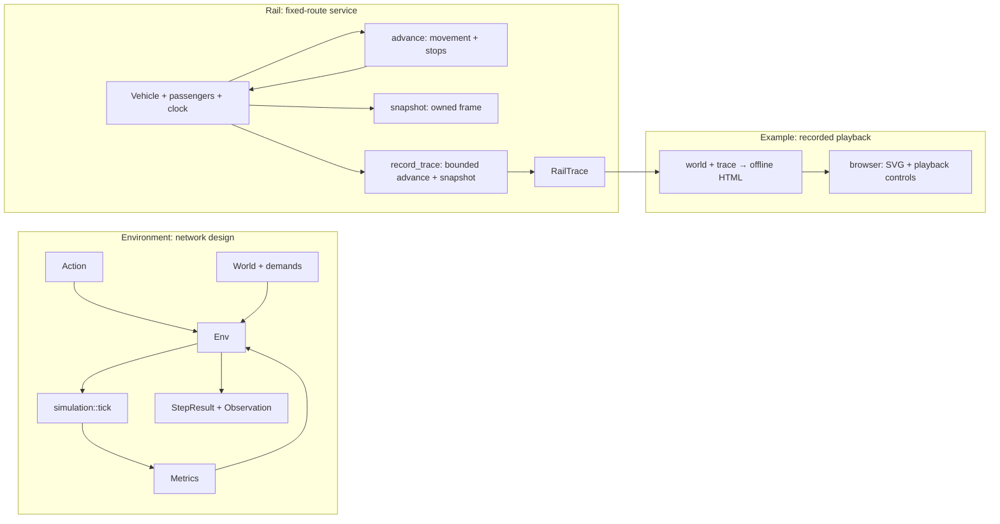

# Architecture

`urbanflow` is a Rust library with two independent simulation paths: `Env` evaluates network-building actions through aggregate demand allocation, while `rail` models one vehicle's timed service. Rail movement does not advance with `Env::step` or feed its metrics.

See [README](README.md) for usage and [AGENTS](AGENTS.md) for contributor rules and validation commands. Detailed API contracts live beside the source linked below.

## Overview

```mermaid
flowchart LR
    subgraph Environment["Environment: network design"]
        Action --> Env
        World["World + demands"] --> Env
        Env --> Allocation["simulation::tick"]
        Allocation --> Metrics
        Metrics --> Env
        Env --> Result["StepResult + Observation"]
    end
    subgraph Rail["Rail: fixed-route service"]
        State["Vehicle + passengers + clock"] --> Advance["advance: movement + stops"]
        Advance --> State
        State --> Snapshot["snapshot: owned frame"]
        State --> Record["record_trace: bounded advance + snapshot"]
        Record --> Trace["RailTrace"]
    end
    subgraph Presentation["Example: recorded playback"]
        Trace --> HTML["world + trace → offline HTML"]
        HTML --> Viewer["browser: SVG + playback controls"]
    end
```

The library owns simulation rules. Owned observations, snapshots, and traces let consumers retain results and replay movement without borrowing live state or reimplementing those rules.

## Module Map

| Modules                                                                                               | Visibility    | Responsibility                                                              |
| ----------------------------------------------------------------------------------------------------- | ------------- | --------------------------------------------------------------------------- |
| [`world`](src/world.rs), [`demand`](src/demand.rs)                                                    | Public        | Nodes, directed edges, mode capacities and costs, and passenger demand      |
| [`network`](src/network.rs)                                                                           | Public        | Derived adjacency index and directed shortest-path queries                  |
| [`simulation`](src/simulation.rs)                                                                     | Crate-private | Capacity allocation and aggregate metrics, invoked through `Env`            |
| [`env`](src/env.rs), [`action`](src/action.rs)                                                        | Public        | Scenario lifecycle, action validation, episode state, and rewards           |
| [`time`](src/time.rs)                                                                                 | Public        | Checked integer simulation clock                                            |
| [`rail`](src/rail.rs)                                                                                 | Public        | Validated routes, vehicle ticks, passenger lifecycle, snapshots, and traces |
| [`metrics`](src/metrics.rs), [`observation`](src/observation.rs), [`step_result`](src/step_result.rs) | Public        | Owned outputs for callers                                                   |

## Execution Flows

### Environment

`Env::new` validates topology (duplicate node IDs, then initial-edge endpoints), demand endpoints in stored order, and finally a finite nonnegative budget, returning the first `InitError`. It preserves supplied node, edge, and demand order. `Env::toy_city` supplies a built-in scenario through this same constructor.

`Env::step` checks episode completion, node endpoints, edge validity, affordability, and arithmetic overflow before mutating anything. It then adds the edge, deducts its cost, increments the step count, allocates demand, and returns metrics, reward, an owned observation, and completion status. Rejected steps leave all environment state unchanged.

`reset()` restores the initial world, demands, and budget, clears metrics and the step count, and returns an observation. It keeps the current `max_steps`, allowing the same actions to reproduce an episode.

### Rail Service

`time::SimulationClock` owns checked integer ticks starting at zero; it has no wall-clock unit, pacing, or scheduling policy. `rail::RailVehicle::advance` coordinates this clock with vehicle and passenger state. Browser playback time belongs to the consumer and never advances this clock.

A `RailRoute` validates a nonempty, ordered sequence of connected Rail edges and owns their IDs and stop nodes captured from the network. A `RailVehicle` owns that route and positive capacity, travel, and dwell durations. Route indices can differ from network IDs: stop zero is the first origin, stop `i > 0` is edge `i - 1`'s destination, and the final stop index is the edge count.

The caller keeps one vehicle, clock, and passenger set together. `advance` coordinates one checked tick, movement, and stop processing atomically. The first tick processes the initial stop before consuming dwell time; later stops are processed on arrival. Every edge uses the same configured travel duration, and each departure follows the configured dwell duration. Final arrival completes service without a final dwell; further advances are no-ops.

`RailPassengers` owns aggregate lifecycle counts per demand, rather than individual passenger agents. All passengers begin waiting. Stops alight destination passengers before boarding demand that originates at the current stop and has a destination later in the route, in stored demand order within vehicle capacity. Repeated nodes use the remaining stop sequence. Passengers who have not boarded remain waiting, including demand outside the route or left behind by a full vehicle; any still outstanding at final arrival become unserved. Vehicle capacity is separate from the edge capacities used by aggregate `simulation` allocation; Rail service does not use shortest-path routing or congestion to decide movement.

`snapshot` reads an owned frame without processing stops or advancing time. `record_trace` reuses `advance` and `snapshot` to record the initial state and each tick until completion or a required tick limit, reporting incomplete runs through `completed`. Reaching the limit leaves the service and passenger counts at the last recorded tick, without completing unfinished journeys. A trace error returns no trace but retains earlier successful ticks. Each frame owns a copy of the passenger records, so callers must choose a limit suitable for an in-memory trace. Tick sequencing, count validation, and snapshot/trace edge cases are specified in the [Rail API](src/rail.rs).

## Simulation Contracts

- Edges are directed; a return connection requires another edge and its construction cost. Self-connections and same-mode duplicates are rejected, while Road and Rail may share an ordered node pair.
- Each demand follows the first shortest path by hop count, breaking ties by edge insertion order. Demands consume shared capacity in stored order, limited by the smallest remaining capacity on their path; unreachable and excess demand is unserved.
- Congestion is the maximum edge load divided by capacity, or zero without edges. Cost sums all edge construction costs. Reward is `served demand - unserved demand - congestion - cost`.
- Available actions follow stored `from` node order, `to` node order, then `EdgeKind::ALL`, omitting invalid or unaffordable edges. The list is empty at the step limit; an episode is done whenever no actions remain.
- Simulation time starts at zero and uses checked integer ticks. Time and passenger processing errors preserve the failed Rail tick's vehicle, clock, and passengers together.
- Rail passenger counts preserve each original demand, including duplicates and zero amounts: waiting, onboard, arrived, and unserved always sum to its amount. Owned outputs retain their data across later state changes.

## Training Consumers

The [`random_policy`](examples/random_policy.rs) and [`tabular_q_learning`](examples/tabular_q_learning.rs) examples use `reset`, `available_actions`, and `step` through the public API. Policy state stays outside the core. These are fixed-seed baselines with one decision and one step per episode; the learner keeps one value per action, without a general state table or multi-step training loop.

## Browser Consumer

The [README walkthrough](README.md#browser-viewer) is the supported local generation and playback workflow. Rust finishes recording before the browser opens; playback reads those fixed snapshots. Identical scenario inputs and ordering produce identical traces and HTML, regardless of browser playback speed or seeking.

The [`rail_viewer`](examples/rail_viewer.rs) example records a small service through `RailVehicle::record_trace` and writes one offline HTML file. Its [consumer module](examples/rail_viewer/mod.rs) serializes the world and trace into a fixed JSON schema; IDs and 64-bit tick values use strings to preserve JavaScript precision. No serialization dependency or public core API is added.

The [embedded template](examples/rail_viewer/viewer.html) owns SVG layout, edge styling, snapshot selection, and playback controls. Nodes follow stored order, parallel and reverse edges are separated, and the marker uses the snapshot's node or resolved edge ID and travel progress.

Playback uses `requestAnimationFrame` with elapsed browser time and a fractional snapshot cursor; core traces have one frame per tick. Both animation callbacks and control events read `performance.now()` so an older frame timestamp cannot rewind playback. At 1×, each tick takes one second of viewing time. The marker interpolates travel progress along the existing SVG edge, including arrival, and stays at its node during dwell. Tick labels preserve their exact recorded strings and, with the slider, identify the latest reached snapshot. Pause and speed changes account for elapsed time before changing playback state. Seeking and resetting pause playback; both complete and partial traces stop at their final frame. Empty and single-frame traces cannot play. These controls never advance simulation or mutate trace data.

The status panel reads the same selected snapshot as the tick label. It displays the recorded vehicle state, stop index and node or directed edge, occupancy, and capacity, and sums each passenger lifecycle count across all demand records, including duplicates. Totals use JavaScript `BigInt` to preserve integer precision across records. The panel updates only when the selected snapshot changes, so marker interpolation never produces fractional passenger counts or premature arrivals. Empty traces display unavailable values; single-frame and partial traces retain their recorded state without inferring service completion. Rendering and aggregation remain in the example template.

## Planned Direction

Trams, DRT, broader macro- and micro-level analysis, application interfaces, and large-scale low-latency simulation remain planned. The Rail service currently has one fixed-route vehicle; multiple vehicles, automatic reverse service, timetables, headways, and passenger transfers are separate work. Road traffic, signals, lanes, and congestion-driven movement are not implemented in Rail service. GIS maps, a web server, WebAssembly, and frontend frameworks are also deferred; the current viewer uses a schematic layout and offline HTML.

Future interfaces should use the public crate API and keep rendering, coordinates, serialization, storage, and transport in consumer layers. Add new modules only when a concrete requirement establishes their responsibility.
